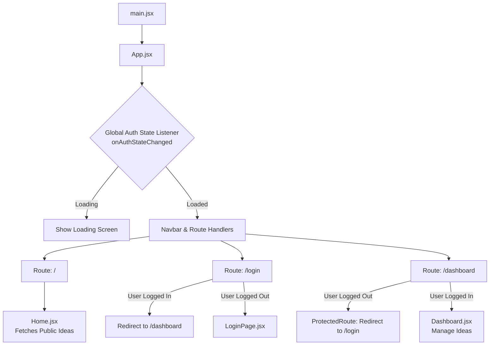

# Project Context: React Firebase Login App

This document serves as the comprehensive context guide for AI agents (Gemini, Claude, Copilot, etc.) and human developers to understand the project architecture, features, and code implementation.

---

## 1. Project Overview & Tech Stack

This is a single-page application (SPA) built using React, Vite, and Tailwind CSS (v4), integrated with Firebase (v12) for Authentication and Cloud Firestore for database storage. 

### Key Features
- **Public Ideas Feed**: Anyone can view publicly shared ideas on the home page.
- **Multimodal Authentication**:
  - Google Sign-In (via pop-up).
  - Traditional Email & Password (register and login).
  - Passwordless Email Link (Magic Link).
- **Personalized Dashboard**: Authenticated users can create, edit, and delete their ideas, with options to toggle visibility (Public vs. Private).

### Tech Stack
- **Frontend Framework**: [React v19](https://react.dev) + [Vite v7](https://vite.dev) (Fast dev server & bundler).
- **Styling**: [Tailwind CSS v4](https://tailwindcss.com) (configured via `@tailwindcss/vite` plugin).
- **Routing**: [React Router v7 (react-router-dom)](https://reactrouter.com).
- **Backend Services**: [Firebase v12 SDK](https://firebase.google.com) (Auth & Firestore).
- **Deployment**: Configured for Vercel SPA routing.

---

## 2. Directory Structure & Key Files

Here is a map of the important files in the repository:

```
├── .env                  # Dev environment variables (Gitignored)
├── .env.example          # Template for required environment variables
├── .env.prod             # Production environment variables (Vercel generated)
├── index.html            # Entry point HTML document
├── package.json          # Dependency list and npm scripts
├── vercel.json           # Vercel SPA rewrite rules
├── vite.config.js        # Vite + Tailwind v4 build settings
└── src/
    ├── main.jsx          # Mounts the React application
    ├── App.jsx           # Routing structure, global Auth state listener, and ProtectedRoute
    ├── Navbar.jsx        # Navigation component with adaptive login/logout states
    ├── Home.jsx          # Public feed, fetches and lists only public ideas
    ├── LoginPage.jsx     # Handles credentials, Google OAuth, and Passwordless sign-in callbacks
    ├── Dashboard.jsx     # Protected workspace to create, update, and delete ideas
    ├── firebase.js       # Firebase initialization, Auth helpers, and Firestore queries
    ├── index.css         # Global styles & Tailwind v4 directives
    └── assets/           # Client-side static assets
```

---

## 3. Data Flow & Authentication Architecture

The application implements a global authentication listener that propagates the user session to the subcomponents and enforces secure routing.

### 3.1 App State & Routing flow


### 3.2 Magic Link (Passwordless) Flow
Passwordless authentication relies on a secure browser-to-email loop:

```
[LoginPage] -> Enters Email -> Triggers sendEmailLink() -> Firebase sends email with dynamic URL
                                                                   │
                                                                   ▼
User clicks email link -> Redirected to: https://google-login-app-beta.vercel.app/login?email=...
                                                                   │
                                                                   ▼
[LoginPage] on load -> Detects URL params ('mode=signIn' and 'oobCode') -> Completes signInWithLink()
```

- **Callback Detection**: When the email link is clicked, the URL parameters contain `mode=signIn` and `oobCode` (out-of-band code).
- **Fallback Email**: The user email is retrieved from the URL query params (`?email=...`), or falls back to `localStorage.getItem('emailForSignIn')`.
- **Completion**: Once authenticated, the user session updates via the global listener in `App.jsx`, triggering a redirect from `/login` to `/dashboard`.

---

## 4. Database Schema (Cloud Firestore)

Firestore stores user-created ideas in a single root-level collection called `ideas`.

### `ideas` Collection Document Fields

| Field Name | Type | Description |
| :--- | :--- | :--- |
| `id` | `string` | Unique identifier generated automatically by Firestore. |
| `titulo` | `string` | Title of the idea. |
| `idea` | `string` | Detailed description/body text of the idea. |
| `public` | `boolean` | `true` if visible to everyone, `false` if private to the creator. |
| `createdBy` | `string` | Email of the user who created the idea. |
| `createdByName` | `string` | Display name or email of the creator. |
| `timestamp` | `number` | Epoch millisecond timestamp of creation. |

---

## 5. Architectural "Gotchas" & Optimization Pointers

Future developers and agents should be aware of these implementation details and potential improvement areas:

### ⚠️ Firestore Security Rules
- **Current Rules**: Currently, the rules are set to `allow read, write: if true;` (completely open). 
- **Urgent Action**: In production, these should be hardened so that:
  - Public ideas are globally readable.
  - Ideas can only be written, updated, or deleted if the user is authenticated and matches the `createdBy` field.

### ⚠️ Environment Variables & Vite Prefix
- Vite only exposes variables prefixed with `VITE_` to client-side code (e.g., `import.meta.env.VITE_FIREBASE_API_KEY`).
- When importing from Vercel or third-party CLI systems, verify that variables don't contain escaped literal `\n` strings, which will break the API keys.

### ⚠️ Magic Link Hardcoded Callback URL
- Inside `src/firebase.js` (line 40), the magic link redirection URL is hardcoded:
  ```javascript
  url: `https://google-login-app-beta.vercel.app/login?email=${email}`
  ```
- **Limitation**: This prevents the magic link from working seamlessly in localhost environments unless modified.
- **Proposed Optimization**: Dynamic detection of the hosting origin:
  ```javascript
  const currentOrigin = window.location.origin;
  await sendSignInLinkToEmail(auth, email, {
    url: `${currentOrigin}/login?email=${email}`,
    handleCodeInApp: true,
  });
  ```

---

## 6. How to Run & Build

### Development
Start the local development server on `http://localhost:5173`:
```bash
npm run dev
```

### Build & Production
Validate and compile the project into static files located in `/dist`:
```bash
npm run build
```

### Code Formatting and Linting
```bash
npm run lint
```
